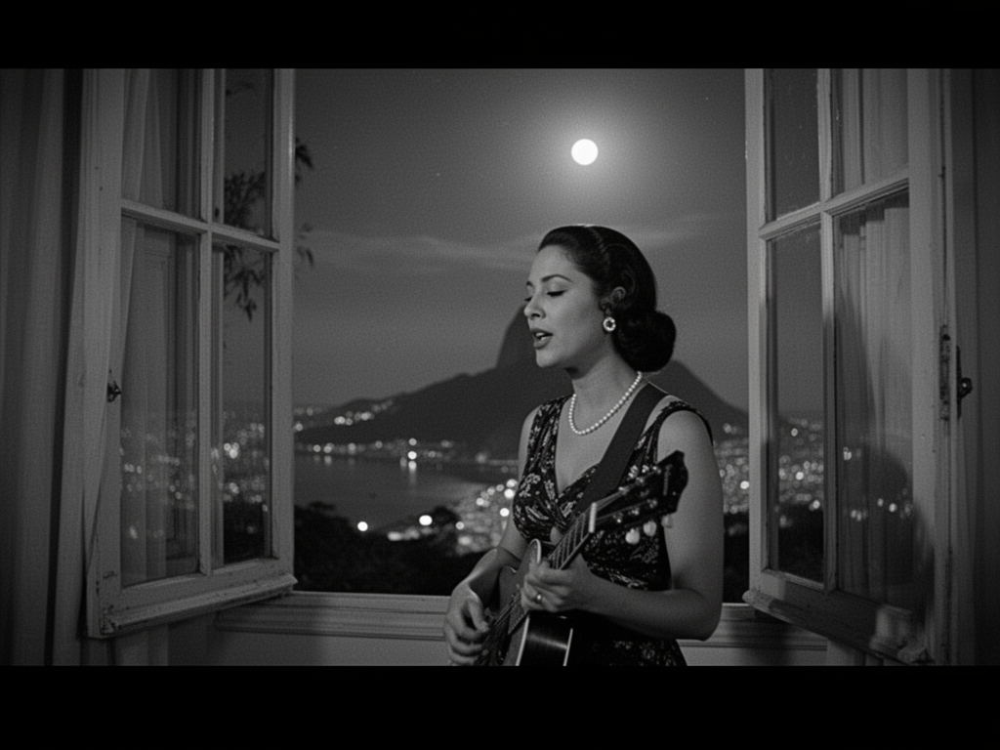
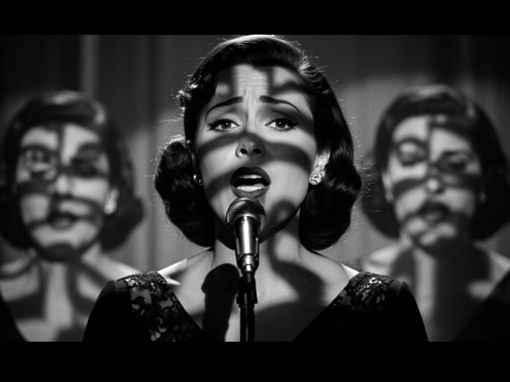
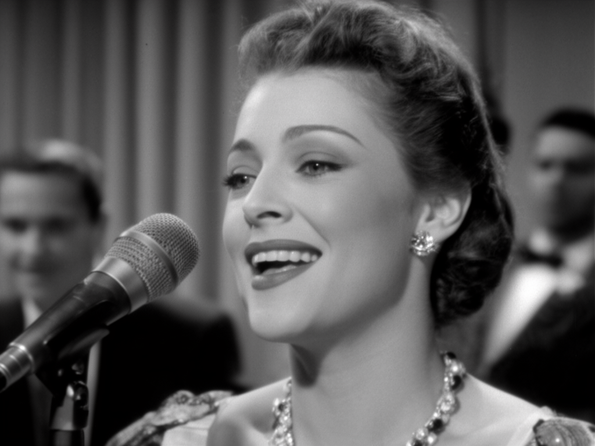

# NADINE  
## Jazz · Bossa Nova · Chanson

---

## PROGRAMM – ÜBERSICHT

### Jazz & Blues
- Lover Man (Oh, Where Can You Be?)
- Black Coffee
- Night and Day
- It Had to Be You
- Lullaby of Birdland
- What a Difference a Day Made
- Have You Met Miss Jones?
- Love Me or Leave Me
- Softly, as in a Morning Sunrise
- Miss Celie’s Blues (Sister)

### Bossa Nova / Brasil
- Agua de Beber
- Corcovado
- A Felicidade
- The Gentle Rain

### Chanson Français
- Milord
- La Bohème
- Jardin d’Hiver
- Padam… Padam
- Dans ma rue
- Que reste-t-il de nos amours ?
- Sous le ciel de Paris
- C’est si bon

---

## JAZZ & BLUES

### Lover Man (Oh, Where Can You Be?)  
*1944 (USA) – Jimmy Davis, Roger Ramirez, Jimmy Sherman · Billie Holiday, Sarah Vaughan*

“Lover Man” entstand während des Zweiten Weltkriegs und trägt die Einsamkeit dieser Zeit in sich. Der Song spricht nicht von Romantik, sondern von einem schmerzhaften Mangel an Nähe. Berühmt wurde er durch Billie Holiday, deren Interpretation den Titel zu einem nächtlichen Bekenntnis machte. Ihre Stimme klingt suchend und verletzlich. Musikalisch verlangt das Stück große Zurückhaltung und Vertrauen in die Stille. Es ist kein Lied für große Gesten, sondern für Momente, in denen das Publikum unwillkürlich den Atem anhält.

---

### Black Coffee  
*1948 (USA) – Sonny Burke, Paul Francis Webster · Peggy Lee, Ella Fitzgerald*

„Black Coffee“ ist ein Song über schlaflose Nächte und innere Leere. Die Bilder sind bewusst schlicht gehalten: eine Tasse Kaffee, Zigarettenrauch, endlose Stunden des Wartens. Gerade diese Reduktion verleiht dem Stück seine Kraft. Peggy Lee prägte den Song mit einer kühlen, kontrollierten Interpretation, die den Schmerz nicht dramatisiert, sondern nüchtern beschreibt. Musikalisch bewegt sich „Black Coffee“ zwischen Blues und Jazzballade. Der Song lebt vom Understatement und von der Erkenntnis, dass Traurigkeit oft leise, aber allgegenwärtig ist.

---

### Night and Day  
*1932 (USA) – Cole Porter · Frank Sinatra, Ella Fitzgerald*

Cole Porter schrieb „Night and Day“ als Lied über eine Liebe ohne Pause. Der Text beschreibt eine obsessive Hingabe, die Tag und Nacht bestimmt und keinen Abstand zulässt. Harmonisch ist der Song raffiniert und ungewöhnlich, was ihn für Jazzmusiker besonders reizvoll macht. Frank Sinatra verlieh ihm urbane Eleganz, Ella Fitzgerald Leichtigkeit und Präzision. „Night and Day“ wirkt zeitlos, weil es weniger eine konkrete Geschichte erzählt als einen inneren Zustand beschreibt. Es ist ein Song über Gedanken, die immer wieder zum selben Menschen zurückkehren.

---

### It Had to Be You  
*1924 (USA) – Isham Jones, Gus Kahn · Billie Holiday, Harry Connick Jr.*

„It Had to Be You“ gehört zu den frühen Jazzstandards und hat sich über Jahrzehnte seinen Charme bewahrt. Der Song erzählt von einer Liebe, die trotz aller Zweifel unausweichlich erscheint. Seine Stärke liegt in der Mischung aus Wärme, Selbstironie und Ehrlichkeit. Billie Holiday verlieh dem Stück eine leise Melancholie, während spätere Interpret:innen oft den humorvollen Ton betonten. „It Had to Be You“ wirkt zugänglich und vertraut, ohne banal zu sein. Ein Lied, das Nähe schafft und sofort eine Verbindung zum Publikum herstellt.

---

### Lullaby of Birdland  
*1952 (USA) – George Shearing, George David Weiss · Ella Fitzgerald, Sarah Vaughan*

„Lullaby of Birdland“ ist eine musikalische Liebeserklärung an das New Yorker Jazzleben der 1950er-Jahre. Benannt nach dem legendären Club Birdland, verbindet der Song Swing, Eleganz und urbane Leichtigkeit. Die Melodie ist eingängig, bietet aber viel Raum für Phrasierung und Improvisation. Ella Fitzgerald und Sarah Vaughan machten das Stück zu einem festen Bestandteil des Vokaljazz-Repertoires. „Lullaby of Birdland“ wirkt lebendig und zugleich kultiviert. Es eignet sich besonders gut als Auftakt oder als verbindendes Element innerhalb eines Sets.

---

### What a Difference a Day Made  
*1934 (Mexico/USA) – María Grever · Dinah Washington*

„What a Difference a Day Made“ erzählt von der plötzlichen Verwandlung durch Liebe. Innerhalb eines einzigen Tages wird aus Einsamkeit Glück. Geschrieben wurde der Song von der mexikanischen Komponistin María Grever, international berühmt wurde er durch Dinah Washington. Ihre warme, direkte Interpretation machte das Stück zu einem Klassiker. Musikalisch verbindet der Song romantische Melodik mit einem dezenten lateinischen Unterton. „What a Difference a Day Made“ ist ein Lied über Hoffnung und darüber, wie unerwartet sich das Leben verändern kann.

---

### Have You Met Miss Jones?  
*1937 (USA) – Richard Rodgers, Lorenz Hart · Frank Sinatra*

„Have You Met Miss Jones?“ ist verspielt, charmant und zugleich harmonisch anspruchsvoll. Der Text beschreibt das Verliebtsein mit einem Augenzwinkern, fast wie ein inneres Stolpern über die eigenen Gefühle. Komponiert von Rodgers und Hart, wurde das Stück schnell zu einem Favoriten unter Jazzmusiker:innen. Besonders bekannt ist es für seine überraschenden Harmoniewechsel, die später viele Bebop-Kompositionen beeinflussten. Der Song verbindet Leichtigkeit mit Raffinesse und zeigt, wie intelligent und humorvoll Jazz sein kann, ohne an Tiefe zu verlieren.

---

### Love Me or Leave Me  
*1928 (USA) – Walter Donaldson, Gus Kahn · Nina Simone*

„Love Me or Leave Me“ ist ein klares Statement. Der Text fordert Ehrlichkeit und Konsequenz in der Liebe: ganz oder gar nicht. Ursprünglich als Broadway-Song geschrieben, erhielt das Stück durch Nina Simone eine neue, kraftvolle Bedeutung. Ihre Interpretation machte daraus eine selbstbewusste Erklärung von Unabhängigkeit und Würde. Rhythmisch lebendig und textlich direkt, wirkt der Song erstaunlich modern. „Love Me or Leave Me“ passt besonders gut in Programme, die Haltung zeigen und emotionale Klarheit betonen.
'*++*

---

### Softly, as in a Morning Sunrise  
*1928 (USA) – Sigmund Romberg, Oscar Hammerstein II · John Coltrane*

„Softly, as in a Morning Sunrise“ stammt ursprünglich aus einer Operette, wurde jedoch im Jazz neu entdeckt und weiterentwickelt. Besonders bekannt ist das Stück für seinen markanten Moll-Charakter, der ihm eine dunkle, spannungsvolle Atmosphäre verleiht. Instrumentalisten wie John Coltrane machten es zu einem festen Bestandteil des modernen Jazz. Gesungen entfaltet der Song eine dramatische, fast filmische Wirkung. Er erzählt von Verführung, Leidenschaft und innerer Unruhe und verbindet Eleganz mit emotionaler Tiefe.

---

### Miss Celie’s Blues (Sister)  
*1985 (USA) – Quincy Jones, Rod Temperton, Lionel Richie · The Color Purple*

„Miss Celie’s Blues“ stammt aus dem Film The Color Purple und ist mehr als ein klassischer Jazzsong. Das Stück erzählt von Selbstermächtigung, Solidarität und innerer Befreiung. Musikalisch verbindet es Blues, Gospel und Soul zu einer kraftvollen Einheit. Die berühmte Filmszene, in der der Song erklingt, machte ihn zu einem Symbol weiblicher Stärke. „Miss Celie’s Blues“ wirkt direkt und emotional, mit einer klaren Botschaft. Ein kraftvoller Abschluss für den Jazz-&-Blues-Teil des Programms.

---

## BOSSA NOVA / BRASIL

### Agua de Beber  
*1963 (Brasil) – Antônio Carlos Jobim, Vinícius de Moraes · Astrud Gilberto*

„Agua de Beber“ gehört zu den helleren Momenten der Bossa Nova. Der Song feiert Leben, Liebe und Erneuerung mit einer Leichtigkeit, die typisch für Jobims Musik ist. Wasser dient als Symbol für Verlangen und Neubeginn. International bekannt wurde das Stück durch Astrud Gilberto, deren zurückhaltender Gesang den Charakter der Bossa Nova prägte. „Agua de Beber“ wirkt offen, fließend und natürlich. Es bringt Frische ins Programm und schafft eine entspannte, sonnige Atmosphäre, ohne oberflächlich zu sein.

---

### Corcovado (Quiet Nights of Quiet Stars)  
*1962 (Brasil) – Antônio Carlos Jobim · João Gilberto*

„Corcovado“ ist eines der stillsten und intimsten Stücke der Bossa Nova. Jobim schrieb den Song als musikalisches Gegenbild zur Hektik des Alltags. Ruhige Nächte, leise Sterne und Nähe ohne große Worte stehen im Mittelpunkt. João Gilbertos reduzierte Interpretation machte den Song stilprägend. „Corcovado“ lebt von Pausen und Zurückhaltung. Es ist weniger ein Lied als ein Zustand – ruhig, warm und zeitlos.

---

### A Felicidade  
*1959 (Brasil) – Antônio Carlos Jobim, Vinícius de Moraes · Elis Regina*

„A Felicidade“ zeigt die nachdenkliche Seite der Bossa Nova. Der Text beschreibt Glück als etwas Flüchtiges, das nur für kurze Momente existiert. Diese leise Melancholie steht im Kontrast zur oft sonnigen Wahrnehmung brasilianischer Musik. Jobims elegante Melodie verbindet sich mit der poetischen Tiefe von Vinícius de Moraes. Interpret:innen wie Elis Regina gaben dem Song emotionale Schwere. „A Felicidade“ ist still, schön und philosophisch.

---

### The Gentle Rain  
*1965 (Brasil/USA) – Luiz Bonfá, Matt Dubey · Astrud Gilberto*

„The Gentle Rain“ verbindet brasilianische Harmonik mit internationalem Jazzgefühl. Ursprünglich für einen Film geschrieben, besitzt der Song eine ausgeprägt cineastische Qualität. Regen wird zum Bild für Erinnerung, Nähe und leise Sehnsucht. Astrud Gilbertos Interpretation verlieh dem Stück seine schwebende Leichtigkeit. „The Gentle Rain“ wirkt modern, ruhig und fließend. Ideal für intime Set-Momente, in denen Musik mehr andeutet als ausspricht.

## CHANSON FRANÇAIS

### Milord  
*1959 (France) – Marguerite Monnot · Édith Piaf*

„Milord“ ist eines der großen erzählerischen Chansons des französischen Repertoires. Der Song beschreibt die Begegnung zweier Menschen aus unterschiedlichen Welten und lebt von direkter Ansprache und emotionaler Nähe. Édith Piafs Interpretation machte ihn weltberühmt. Ihre Stimme führt durch Mitleid, Stolz und menschliche Wärme. „Milord“ ist weniger ein Lied als eine Szene, fast ein kleines Theaterstück. Er verlangt Präsenz, Textbewusstsein und Mut zur Emotion.

---

### La Bohème  
*1965 (France) – Charles Aznavour · Charles Aznavour*

„La Bohème“ ist ein Lied über Erinnerung, Jugend und verlorene Zeit. Aznavour blickt zurück auf das Leben junger Künstler in Paris, zwischen Armut, Hoffnung und Freiheit. Der Song ist von tiefer Nostalgie geprägt, ohne sentimental zu werden. Seine Kraft liegt in der Ehrlichkeit und Klarheit der Erzählung. „La Bohème“ wirkt zeitlos, weil es universelle Themen berührt: Träume, Vergänglichkeit und das bittersüße Wissen, dass nichts zurückkehrt.

---

### Jardin d’Hiver  
*2000 (France) – Benjamin Biolay, Keren Ann · Henri Salvador*

„Jardin d’Hiver“ steht für das moderne französische Chanson. Der Song erzählt von später Liebe, Ruhe und innerem Rückzug. Henri Salvador verlieh dem Stück eine besondere Sanftheit und Würde. Die Musik ist reduziert, warm und intim. „Jardin d’Hiver“ wirkt wie ein leiser Dialog mit sich selbst. Er braucht keine großen Gesten, sondern lebt von Nähe, Stimme und Atmosphäre.

---

### Padam… Padam  
*1951 (France) – Norbert Glanzberg · Édith Piaf*

„Padam… Padam“ beschreibt das unaufhaltsame Wiederkehren von Erinnerungen. Der rhythmische Titel ahmt den Herzschlag nach und verstärkt die innere Unruhe des Textes. Édith Piaf machte den Song zu einem psychologischen Porträt von Liebe und Verlust. Die Musik wirkt fast hypnotisch. „Padam… Padam“ ist intensiv, fordernd und emotional aufgeladen. Ein Chanson, das Spannung aufbaut und nicht loslässt.

---

### Dans ma rue  
*1955 (France) – Marguerite Monnot · Édith Piaf*

„Dans ma rue“ ist ein leises, beobachtendes Chanson. Es erzählt vom Alltag, von Menschen und kleinen Momenten in einer Pariser Straße. Die Stärke des Songs liegt in seiner Schlichtheit. Piafs Interpretation verleiht den scheinbar unspektakulären Szenen Tiefe und Menschlichkeit. „Dans ma rue“ wirkt nah und authentisch. Es zeigt, wie das französische Chanson aus Alltagsbeobachtungen Poesie entstehen lässt.

---

### Que reste-t-il de nos amours ?  
*1942 (France) – Léo Chauliac · Charles Trenet*

„Que reste-t-il de nos amours ?“ stellt eine einfache, aber tiefgehende Frage: Was bleibt von der Liebe? Der Song ist von Melancholie und Wehmut geprägt, ohne bitter zu sein. Charles Trenet verband Leichtigkeit mit Nachdenklichkeit. Das Chanson lebt von Zurückhaltung und feiner Emotion. Es wirkt wie ein stiller Rückblick, voller Erinnerung und leiser Traurigkeit.

---

### Sous le ciel de Paris  
*1951 (France) – Hubert Giraud, Jean Dréjac · Juliette Gréco*

„Sous le ciel de Paris“ ist eine musikalische Liebeserklärung an die Stadt selbst. Der Song beschreibt Paris als lebendigen Organismus, voller Geschichten, Stimmen und Stimmungen. Juliette Gréco prägte das Stück mit ihrer ruhigen, erzählerischen Art. Das Chanson wirkt cineastisch und weit. Es schafft sofort Bilder im Kopf und verbindet Romantik mit urbaner Realität.

---

### C’est si bon  
*1947 (France) – Henri Betti · Eartha Kitt, Louis Armstrong*

„C’est si bon“ ist verspielt, elegant und international. Der Song verbindet französische Leichtigkeit mit Jazzgefühl und Swing. Durch Interpret:innen wie Eartha Kitt und Louis Armstrong wurde er weltweit bekannt. „C’est si bon“ wirkt charmant und mühelos, ohne oberflächlich zu sein. Ein Chanson, das Lebensfreude ausstrahlt und Leichtigkeit in jedes Programm bringt.